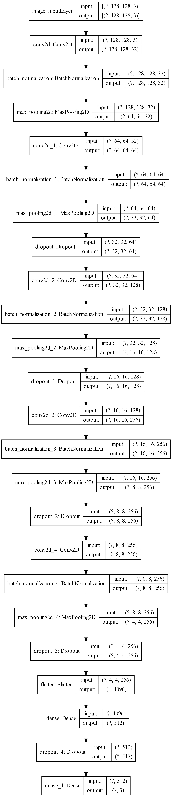
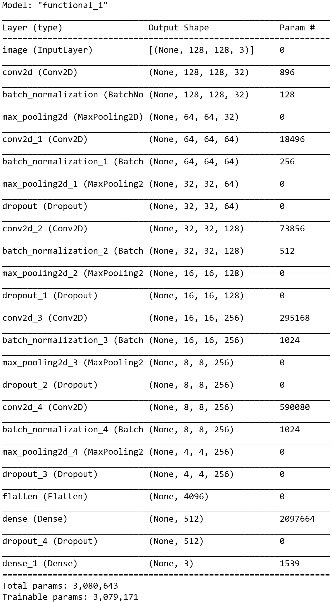

# **SLM-CNN**

This repository contains the source code (written in python 3.7), trained CNN model and examples for the proceedings paper:

CNN based powder bed monitoring and anomaly detection for the selective laser melting process

## This repository

This repository contains:
| Folder/file | Description |
| --- | --- |
| model | The trained CNN model, as described in the above mentioned paper |
| source | Source code for training and evaluating the model |
| Test_Data\Layers | Sample full layer images from the test set |
| Test_Data\Patches | Sample patches, extracted from layers of the test set |
| requirements.txt | Containing the required python modules |
| model_plot.png<br>model_summary.png | Tensorflow/Keras graphical output of the trained model |

## Installation

If you want to run the model on the provided samples, please install the requirements.txt first:
```
pip install -r requirements.txt
```

## Architecture
  

## Results
The model architecture, as seen in the previous section, was trained five times. Classification results were obtained by averaging the classification results of the test set.

| Class | Precision | Recall | F1-Score |
| --- | --- | --- | --- |
| Powder | 0.8418±0.0279 | 0.9804±0.0071 | 0.9057±0.0190 |
| Object | 0.9039±0.0150 | 0.7540±0.0291 | 0.8216±0.0127 |
| Error | 0.8343±0.0150 | 0.8607±0.0213 | 0.8471±0.0113 |
| Accuracy | | | 0.8574±0.0080 |
| Macro Average Accuracy | 0.8600±0.0070 | 0.8650±0.0076 | 0.8581±0.0084 |
| Weighted Average Accuracy | 0.8618±0.0064 | 0.8574±0.0080 | 0.8552±0.0082 |

## **Citation**

Please consider citing this paper if you deem it helpful in your research:

```
Placeholder
for
bibtex cite
```

## **Contact**

aydin [.] deliktas [_at ] th-ab [.] de

michael [.] moeckel [_at_] th-ab [.] de
