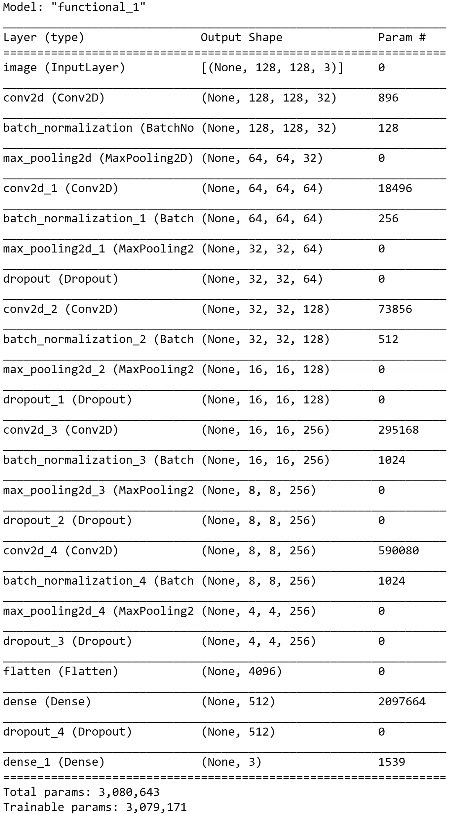

# **SLM-CNN**

This repository contains the source code (written in python 3.8), trained CNN model and examples for the proceedings paper:

CNN based powder bed monitoring and anomaly detection for the selective laser melting process

## Classification Samples

### Patch wise
Classification of small patches and their heatmaps, showing the regions which were regarded as important for the neural network during classification.
The Baseline is the starting point. Integrated Gradients are trying to find the important datapoints during classification. Attribution Mask is then applied to the original image as an overlay.

<p float="left">
  
   
   
</p>


### Entire Layer
Patch wise classification with a patch size of 128x128 pixels and then applied to the entire powder bed Layer.

Colors:

White: Powder | Blue: Objects | Red: Error

<p float="left">
  
   
   
</p>

## This repository

This repository contains:
| Folder/file | Description |
| --- | --- |
| model | The trained CNN model, as described in the above mentioned paper |
| source | Source code for training and evaluating the model |
| CNN\train_classifier.py | File used to train the model |
| CNN\predict_layer.py | File used to classify entire powder bed image layer |
| CNN\predict_patches.py | File used to classify small patches extracted from the powder bed|
| CNN\modules\\* | Modules used in the source code |
| Test_Data\Layers\ | Sample full layer images from the test set |
| Test_Data\Patches\ | Sample patches, extracted from layers of the test set<br>Note: Patches are sorted by class|
| requirements.txt | Containing the required python modules |
| images | Training and validation history<br>Tensorflow/Keras graphical output of the trained model<br>Classified Layer samples |

## Installation

If you want to run the model on the provided samples, please install the requirements.txt first:
```
pip install -r requirements.txt
```
After the installation, you can run the trained model by starting the python files.

## Architecture
 


## Results
The model architecture, as seen in the previous section, was trained five times. Classification results were obtained by averaging the classification results of the test set.

| Class | Precision | Recall | F1-Score |
| --- | --- | --- | --- |
| Powder | 0.8418±0.0279 | 0.9804±0.0071 | 0.9057±0.0190 |
| Object | 0.9039±0.0150 | 0.7540±0.0291 | 0.8216±0.0127 |
| Error | 0.8343±0.0150 | 0.8607±0.0213 | 0.8471±0.0113 |
| Accuracy | | | 0.8574±0.0080 |
| Macro Average Accuracy | 0.8600±0.0070 | 0.8650±0.0076 | 0.8581±0.0084 |
| Weighted Average Accuracy | 0.8618±0.0064 | 0.8574±0.0080 | 0.8552±0.0082 |


<p float="left">
  
   
</p>

## **Citation**

Please consider citing this paper if you deem it helpful in your research:

```
Placeholder
for
bibtex cite
```

## **Contact**

aydin [.] deliktas [at] th-ab [.] de

michael [.] moeckel [at] th-ab [.] de
